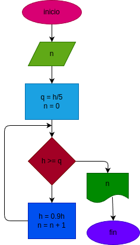

# pelota
Una pelota se deja caer desde una altura h,y en cada rebote sube el 10% menos del anterior

# Analisis

## Input
### Variables de entrada
h: valor a ingresar 
### processin

h = 0.9 * h

n = n + 1

### output

# Diseño

# Construcion 